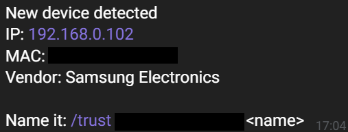
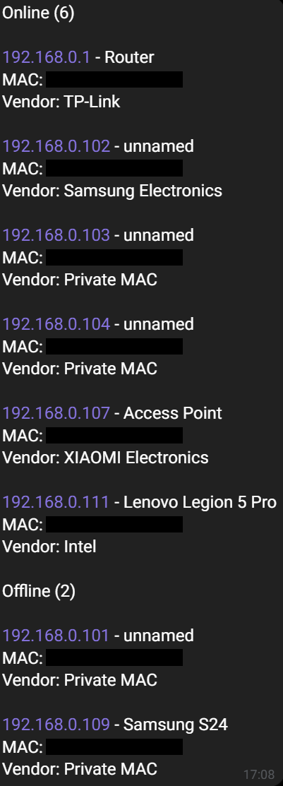

# Netwatch

Telegram bot that watches your home network and alerts you when a new device appears.
It scans the local subnet with `arp-scan`, keeps a small JSON database of known
devices, and can fingerprint a device with `nmap`.

## Features

- New-device alerts
- Device list with online/offline state and custom names
- On-demand fingerprinting: OS guess, open ports, service versions, risky-port hints
- Quick port scan
- Only answers to the owner's Telegram chat; only scans private IP ranges

## Requirements

- Linux on the same L2 network as the devices (if you use a VM, set the network adapter to bridged)
- `arp-scan`, `nmap`, Python 3.10+
- A Telegram bot token and your chat ID

## Setup

The bot needs root (`arp-scan` and `nmap -O` use raw sockets), so it is started
through a small launcher script that loads the config and runs the bot as root.

### 1. Install

```bash
cd ~
sudo apt install -y arp-scan nmap python3-venv git
git clone https://github.com/javidanagha/netwatch.git
cd netwatch
python3 -m venv ~/netwatch-venv
~/netwatch-venv/bin/pip install -r requirements.txt
```

### 2. Configure

Create a bot with @BotFather to get the token, send your bot a message, then read your
chat ID from `https://api.telegram.org/bot<TOKEN>/getUpdates`.
Find your network interface name with `ip -br a`.

```bash
mkdir -p ~/.netwatch
cp env.example ~/.netwatch/env
chmod 600 ~/.netwatch/env
nano ~/.netwatch/env
```

Set `BOT_TOKEN`, `CHAT_ID` and `IFACE`. Set `DB_PATH` to a writable location,
for example `/home/USER/.netwatch/known.json`.

### 3. Create the launcher

Replace `USER` with your username.

```bash
sudo tee /usr/local/bin/netwatch >/dev/null <<'EOF'
#!/bin/bash
[ "$EUID" -ne 0 ] && exec sudo "$0" "$@"
set -a
. /home/USER/.netwatch/env
set +a
exec /home/USER/netwatch-venv/bin/python /home/USER/netwatch/bot.py
EOF
sudo chmod +x /usr/local/bin/netwatch
```

### 4. Run

```bash
netwatch
```

The bot runs in the foreground. On the first scan it stores all
devices it finds as the baseline without alerts; after that, any unknown MAC triggers an alert.

## Commands

```
/scan                  scan now
/list                  all devices, online/offline
/info <ip|mac>         OS, open ports, versions
/portscan <ip>         quick port scan
/trust <mac> <name>    name a device
/untrust <mac>         forget a device
/help
```

## Notes and limitations

- The first scan stores every device found as the baseline.
- Detection is MAC-based: a spoofed MAC of a known device will not be flagged.
- Phones with random MACs may show up as new devices per network.
- Sleeping phones can miss ARP probes, so scans use a slow packet interval (`-i 30`);
  one scan takes roughly 25-30 seconds.
- OS detection (`nmap -O`) needs root and often fails on phones (no open ports).

## Screenshots




## Disclaimer

Use only on networks you own or are authorized to test.
